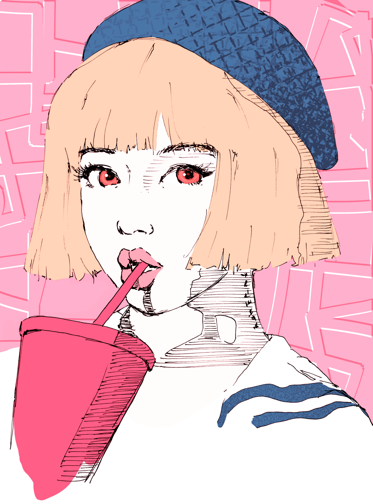

## About this site

**koga.one** is my little museum.

It displays my experiments, my visions, my tendencies.

You can watch it grow live as I slowly but surely create new projects and posts daily.

Follow me as we explore what has yet to be imagined. The screen is our limit!

---

### Posts and projects

I'll be documenting my projects through daily posts. However, unlike traditional blogs, the posts themselves will allow you, viewer, to interact with the ideas.

Not sure what I mean by that?

Just check the posts - you'll see what I mean.

---

## About me

Hey there! I'm André Koga, a 19yr old Brazilian programmer / artist

I love coding, drawing, reading, playing volley and handball, gaming, watching anime, and learning new things!

Nice to meet you!

(〃￣︶￣)人(￣︶￣〃)

---

### Education

In 2021 I was accepted into four international universities, as follows:

1. **Major at Computer Science** - Georgia Institute of Technology
2. **Studies in Computer Science, Mathematics, and Statistics** - University of Toronto, Mississauga
3. **Bachelor of Applied Science Program** - University of British Columbia
4. **Computer Science in the College of Science at West Lafayette** - Purdue University

I chose Georgia Tech. My dream is to use my artistic background together with coding to lead a new tech era!

---

### Projects

I love creating! Most of my projects revolve around arts and tech.

I publish my art pieces on my instagram account: [@koga.one\_](https://www.instagram.com/koga.one_/)

Here is one of my best drawings!

For my games i use Itch.io (eventually Steam): [@koga.one](https://kogaone.itch.io)

[Slimy Situation](https://sushiwaumai.itch.io/slimy-situation) is one of the games I published with my team in a game jam (I tried to put an embed, but it gets a bit wonky)

For design and concepts I use this website

You can check the latest posts [here](/posts)

Finally, if you just want to know what I'm up to, [here](https://twitter.com/koga_one)'s my Twitter:

---

### Skills

I love the idea of having no weak spots. Obviously that's impossible, but I keep trying to improve little by little. Here are some of the skills and activities I've already spent a decent time at (+1000hr).

**Sports**: Baseball, handball, volleyball, table-tennis. Oh, I love dodgeball.

**Languages**: Fluent at Portuguese and English. Currently learning Japanese.

**Tech**: For web projects I use Gatsby, Hugo, and Wordpress, paired with Github of course. For game development I use Unity. I'm advanced at JS and C#. I've already finished Python, PHP, Ruby, C#, web tools (CSS, MD / MDX, HTML), and JS courses.

**Arts**: There are multiple art medias and techniques to be explored. For digital art I use Clip Studio Paint and Aseprite. For traditional art there's nothing better than my trusty ink pen. For design and typography projects I use Figma (and my website).

---

### Awards

Here's a list of the scientific awards I've won throughout my school years.

They're colored by category!

**2014 - 6th grade**

- 
    national
   gold 
    math
   - matemática sem fronteiras
- 
    national
   gold 
    math
   - canguru matemático sem fronteiras
- 
    national
   gold 
    math
   - olimpíada de matematica do poliedro
- 
    national
   
    silver
   computer science - olimpíada
  brasileira de informatica
- state 
    gold
   physics - olimpíada paulista
  de física

**2015 - 7th grade**

- 
    international
   gold 
    math
   - olimpíada de matemática rioplatense
- 
    national
   gold 
    math
   - canguru matemático sem fronteiras
- 
    national
   gold 
    math
   - olimpíada de matematica do poliedro
- 
    national
   
    bronze
   astronomy - olimpíada brasileira
  de astronomia
- 
    national
   
    honorary mention
   computer science - olimpíada
  brasileira de informática
- state 
    gold
   math - olimpíada paulista
  de matemática
- state 
    gold
   physics - olimpíada paulista
  de física

**2016 - 8th grade**

- 
    national
   gold 
    math
   - matemática sem fronteiras nacional
- 
    national
   gold 
    math
   - canguru matemático sem fronteiras
- 
    national
   gold 
    math
   - olimpíada de matematica do poliedro
- 
    national
   gold 
    astronomy
   - olimpíada brasileira de astronomia & astronáutica
- 
    national
   gold 
    physics
   - olimpíada brasileira de física
- 
    national
   
    silver
   robotics - olimpíada brasileira
  de robótica
- 
    national
   
    bronze
   math - olimpíada brasileira
  de matemática
- 
    national
   
    bronze
   computer science - olimpíada
  brasileira de informática
- 
    national
   
    bronze
   chemistry - olimpíada brasileira
  de química
- state 
    gold
   math - matemática sem fronteiras
  regional
- state 
    gold
   math - olimpíada de matematica
  da unicamp

**2017 - 9th grade**

- 
    international
   
    silver
   math - olimpíada de matemática
  lusófona
- 
    international
   
    bronze
   math - olimpíada de matemática
  rioplatense
- 
    national
   gold 
    math
   - brasileira de matemática das escolas públicas
- 
    national
   gold 
    math
   - canguru matemático sem fronteiras
- 
    national
   gold 
    math
   - olimpíada de matematica do poliedro
- 
    national
   gold 
    math
   - matemática sem fronteiras nacional
- 
    national
   
    silver
   physics - olimpíada brasileira
  de física
- 
    national
   
    silver
   robotics - olimpíada brasileira
  de robótica
- 
    national
   
    honorary mention
   chemistry - olimpíada brasileira
  de química
- state 
    gold
   math - olimpíada paulista
  de matemática
- state 
    gold
   math - matemática sem fronteiras
  regional
- state 
    silver
   physics - olimpíada paulista
  de física

**2018 - 10th grade**

- 
    national
   gold 
    math
   - canguru matemático sem fronteiras
- 
    national
   
    silver
   astronomy - olimpíada brasileira
  de astronomia
- 
    national
   
    bronze
   math - olimpíada brasileira
  de matemática
- 
    national
   
    honorary mention
   physics - olimpíada brasileira de física
- state 
    silver
   math - olimpíada paulista
  de matemática
- state 
    bronze
   math - olimpíada cearense
  de matemática

**2019 - 11th grade**

- 
    national
   gold 
    math
   - canguru matemático sem fronteiras
- 
    national
   
    bronze
   math - brasileira de matemática
  das escolas públicas
- 
    national
   
    honorary mention
   math - olimpíada brasileira
  de matemática
